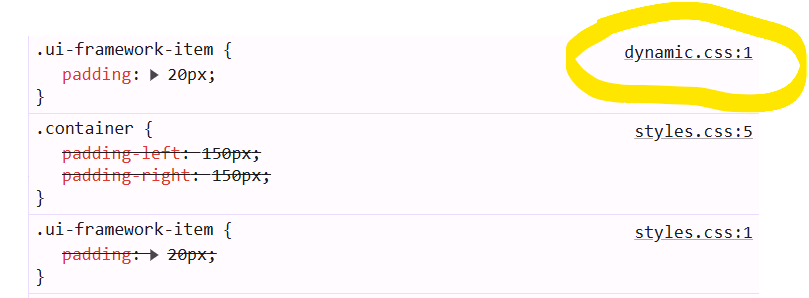

# Explanation

The order in which CSS rules are defined matters. Thus, it's important that the `style.css` _first_ has the general rule from the pretend UI framework:

```css
.ui-framework-item {
  padding: 20px;
}
```

Followed by the more specific

```css
.container {
  padding-left: 150px;
  padding-right: 150px;
}
```

(Note that the order in which the class names are applied to an HTML element does **not** matter: the result is identical whether the div is marked up as `<div class="ui-framework-item container">` versus `<div class="container ui-framework-item">`).

When the dynamic content is loaded, it re-defines the same pretend `.ui-framework-item` class, with the same value. But now, crucially, the CSS for it is loaded _later_, and thus takes higher precedence over the preceding rules. Effectively, we end up with the following, with the last rule winning:

```css
.ui-framework-item {
  padding: 20px;
}

.container {
  padding-left: 150px;
  padding-right: 150px;
}

.ui-framework-item {
  padding: 20px;
}
```

Because `padding` is a shorthand property, it really stands for:

```css
.ui-framework-item {
  padding-top: 20px;
  padding-right: 20px;
  padding-bottom: 20px;
  padding-right: 20px;
}
```

And it thus ends up overriding the `container`'s request for left and right properties being `150px`:


